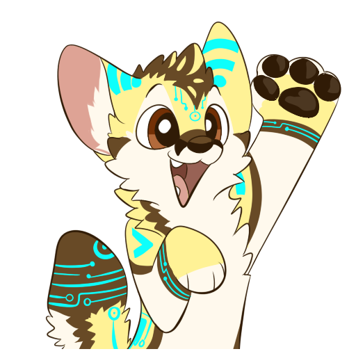

		 

			
		

  

		 

		 I am Lumunix, the WiFi enabled fennec. I am a total nerd when it comes to technology and computing. I love to play video games, talk about consumer and commercial computing hardware, cars and electronics.  
  		

			

				I am also a professional software engineer and work directly on designing and programming commercial enterprise software in a variety of languages and technologies. I love to learn new software development techniques and technologies and love to share my career experiences.
		   

	 	 	

				On this page you can find links to all my social media platform accounts from my Discord server to my Blog, Twitch streams and various other platforms.
      

		

        

            <h2 class="page-header">Social Media</h2>
        

        

            

                

                    
                        
                    
                

                

                    <h4>Discord</h4>
                    
Join my discord where I post announcements, have places to chat and meet others.

                    <a href="https://discord.gg/S44eGxVNzT" class="btn btn-primary">Go</a>
                

            

        

        

            

                

                    
                          
                    
                

                

                    <h4>Twitch</h4>
                    
Check out my twitch channel where I stream game playthroughs or coding sessions.

                    <a href="https://www.twitch.tv/lumunix" class="btn btn-primary">Go</a>
                

            

        

        

            

                

                    
                      
                    
                

                

                    <h4>Telegram Stickers</h4>
                      
Looking for my telegram sticker pack? Here is a link so you can use them!

                    <a href="https://t.me/addstickers/Lumunix" class="btn btn-primary">Go</a>
                

            

        

        

            

                

                    
                      
                    
                

                

                    <h4>Instagram</h4>
                    
Follow my Instagram for my latest fursuit photos and pictures of adventures.

                    <a href="https://www.instagram.com/lum_unix/?hl=en" class="btn btn-primary">Go</a>
                

            

        

        

            

                

                    
                        
                    
                

                

                    <h4>Youtube</h4>
                    
I don't post too often, but I like to make random videos from time to time.

                    <a href="https://www.youtube.com/channel/UClirzTkXbUFGsfP8aiUqOGg" class="btn btn-primary">Go</a>
                

            

        

        

            

                

                    
                          
                    
                

                

                    <h4>Twitter</h4>
                    
Check out my twitter where I post my various thoughts and musings. I joke and like to share my experiences and current projects.

                    <a href="https://twitter.com/Lumunix" class="btn btn-primary">Go</a>
                

            

        

        

            

                

                    
                          
                    
                

                

                    <h4>Github</h4>
                    
Well You are here, this site is hosted on github servers. here is where I host my blog and where you can find all my code projects.

                    <a href="https://lumunix.github.io/" class="btn btn-primary">Go</a>
                

            

        

				

						

								

										
													
										
								

								

										<h4>Blog</h4>
										
Link to my blog where I post code tutorials and talk about technology and current issues in the tech industry.

										<a href="https://lumunix.github.io/blog" class="btn btn-primary">Go</a>
								

						

				

    

